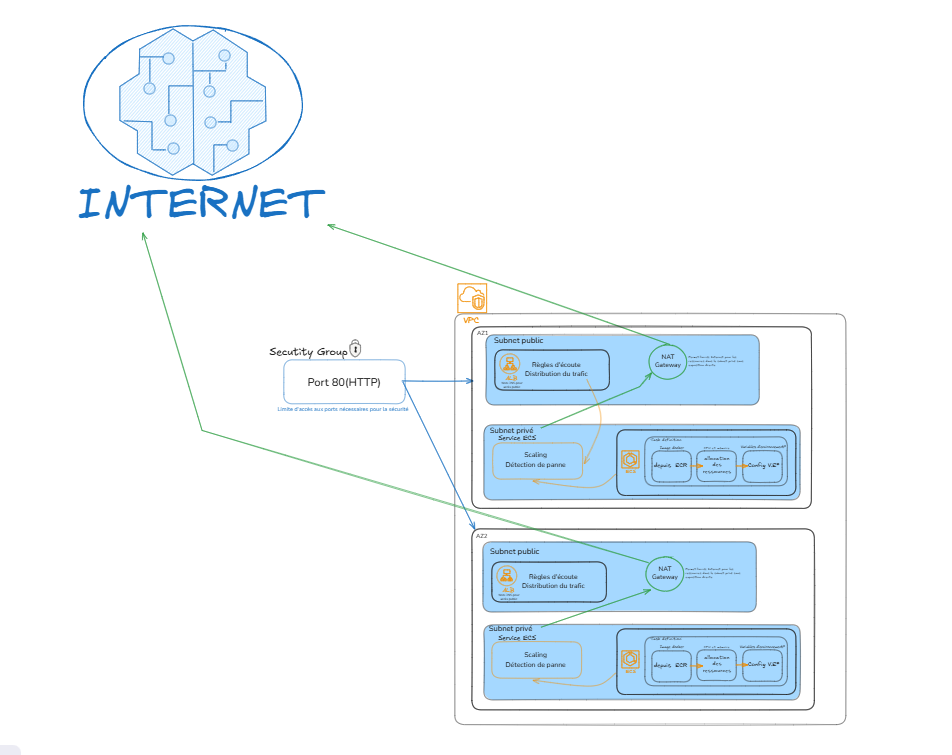

# Déploiement de mon Application Node.js sur AWS avec ECS et ALB

## Introduction :
Ce document détaille les étapes que j'ai suivies pour déployer mon application Node.js sur AWS en utilisant un cluster ECS, un Load Balancer (ALB) et une architecture sécurisée en VPC. Il présente également les défis rencontrés et les solutions apportées.

###  Étapes de Déploiement
## Étape 1 : Création du VPC et des Sous-réseaux
J'ai créé un VPC pour isoler mon réseau, en ajoutant un subnet public pour le Load Balancer et un subnet privé pour le service ECS, où l’application est hébergée.

## Étape 2 : Création de l'Image Docker
À partir de l'image node:18.20.2, j'ai configuré un Dockerfile qui définit l'environnement de travail, installe les dépendances, et expose le port 3000 pour l'application.
Défi : Optimiser le Dockerfile pour assurer une installation rapide et une taille d’image réduite.
Solution : J'ai utilisé COPY package*.json pour copier uniquement les fichiers de dépendance d'abord, afin que le cache Docker soit plus efficace lors de modifications mineures du code.

## Étape 3 : Déploiement dans ECS et Configuration de la Task
J'ai créé un cluster ECS et une Task Definition, où j’ai spécifié l’image Docker, les ressources CPU/mémoire, et les variables d'environnement nécessaires.

## Étape 4 : Configuration de l’ALB
J'ai mis en place un ALB pour diriger le trafic HTTP/HTTPS vers le service ECS.
Défi : Configurer les règles d'écoute pour garantir que le trafic est redirigé correctement vers le port exposé (3000) de l’application.

## Étape 5 : Sécurité et Accès Internet pour les Ressources Privées
J'ai configuré des groupes de sécurité pour limiter l'accès aux seuls ports nécessaires (80 et 443 pour le ALB) et mis en place une NAT Gateway dans le subnet public.
Défi : Assurer l'accès Internet pour les mises à jour et dépendances, tout en sécurisant les ressources en interne.
Solution : En plaçant la NAT Gateway dans le subnet public, j'ai permis aux conteneurs ECS dans le subnet privé d’accéder à Internet sans être exposés.

## Défis et Solutions
Compréhension de la Logique de Déploiement avec AWS : J'ai travaillé sur un schéma pour visualiser et comprendre le déploiement d'une application sur AWS avec ECS, en me concentrant sur les éléments essentiels comme le VPC, les sous-réseaux, les groupes de sécurité, et le Load Balancer.

Gestion des Permissions et Sécurité : Le schéma m'a permis d’explorer comment AWS et les groupes de sécurité pourraient être utilisés pour contrôler les accès de manière sécurisée.

Allocation des Ressources et Architecture Réseau : J'ai étudié comment les ressources CPU et mémoire, ainsi que l’isolation des sous-réseaux, peuvent être organisés pour équilibrer sécurité, coût et performance dans un contexte AWS, sans effectuer de tests ou configurations directes.

### Conclusion :
Ce travail m’a permis de mieux comprendre la logique de déploiement d'une application sur AWS en explorant les concepts clés tels que la configuration réseau, la sécurité, et la gestion des ressources dans ECS. La création du schéma m’a aidé à visualiser les étapes et à structurer une architecture cohérente, sans aller jusqu’à la configuration réelle. Cette approche me donne une base solide pour aborder un déploiement complet à l’avenir.

HAILAF Hajar
